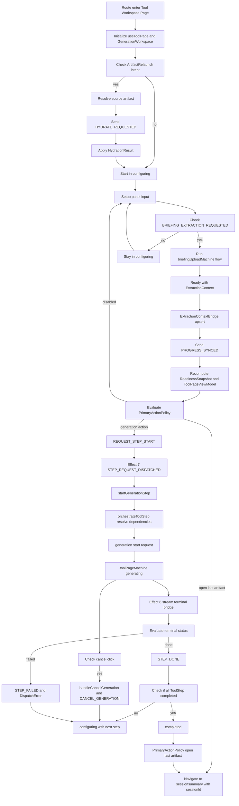

# Tool Page Frontend Runtime Specification

> **AI-first document** — Written to eliminate inferential reconstruction by future agents. Every claim is traceable to a specific file and line range. Do not rely on this document alone: always cross-reference code before making changes.

> **DDD Reference**: canonical terms used here are defined in:
> - `docs/01-requirements/domain-ubiquitous-language-glossary.md` — glossary (including `GenerationWorkspace`, `ExtractionContextBridge`, `DispatchError`, `ReadinessSnapshot`, `ExtractionContext`, `HydrationResult`, `ToolPage`, `BriefingUpload`)
> - `docs/07-governance/domain-naming-decision-log.md` — DDD-069, DDD-070, DDD-061
> - `docs/02-design/specifications/frontend-ui-ubiquitous-language-spec.md` — Tool Workspace Page archetype

---

## 1. File Map

| Role | File | Purpose |
|---|---|---|
| Orchestration hook | `apps/frontend/src/features/tools/runtime/useToolPage.ts` | Single entry point for all tool page logic |
| Page orchestrator machine | `apps/frontend/src/features/tools/machines/tool-page.machine.ts` | XState v5 machine managing page lifecycle states |
| Briefing upload machine | `apps/frontend/src/features/tools/machines/briefing-upload.machine.ts` | XState v5 actor managing briefing file lifecycle |
| Step flow machine | `apps/frontend/src/features/tools/machines/tool-flow.machine.ts` | XState v5 actor managing step progression |
| Presentation component | `apps/frontend/src/features/tools/ui/ToolPageTemplate.tsx` | Pure presentation: form + layout + CTA rendering |
| Generation workspace | `apps/frontend/src/features/generation/runtime/GenerationWorkspaceProvider.tsx` | React context — per-project `ExtractionContext` + stream state |
| Generation dispatch + assembly | `apps/frontend/src/features/tools/runtime/tools-client.ts` | `orchestrateToolStep`, `createStepRequest`, extraction assembly |
| Brief upload endpoint (BE) | `apps/backend/src/lib/runtime/auth-http/tools-brief-handlers.ts` | `/api/tools/briefs` payload validation and normalized text response |
| Step hydration | `apps/frontend/src/features/generation/runtime/step-hydration.ts` | Read projections over `GenerationArtifact` history |
| Artifact client | `apps/frontend/src/features/artifacts/runtime/artifacts-client.ts` | `getArtifactById` — single artifact fetch with local cache |

Tool page wrapper files (minimal, one per tool):
- `apps/frontend/src/features/tools/funnel-pages/pages/FunnelPagesToolPage.tsx`
- `apps/frontend/src/features/tools/nextland/pages/NextlandToolPage.tsx`
- `apps/frontend/src/features/tools/youtube-lf-script/pages/YoutubeLfScriptToolPage.tsx`

---

## 2. State Machine Architecture

### 2.1 `toolPageMachine` (page orchestrator)

File: `apps/frontend/src/features/tools/machines/tool-page.machine.ts`

**Top-level states:**

| State | Meaning | Entry condition |
|---|---|---|
| `configuring` | Default waiting state. Form editable. Primary CTA governed by `ReadinessSnapshot`. | Initial; returned to after `CANCEL_GENERATION` |
| `hydrating` | Resolving extraction context from a prior artifact. | `HYDRATE_REQUESTED` event received |
| `generating` | Generation dispatched and in progress. | `REQUEST_STEP_START` event accepted |
| `completed` | All steps done for current run. | `STEP_DONE` event received with all steps complete |

**Key transitions:**

| From | Event | To |
|---|---|---|
| `configuring` | `HYDRATE_REQUESTED` | `hydrating` |
| `hydrating` | (hydration service resolves) | `configuring` |
| `configuring` | `REQUEST_STEP_START` | `generating` |
| `generating` | `STEP_REQUEST_DISPATCHED` | `generating` (clears `pendingStepStart`) |
| `generating` | `STEP_DONE` | `completed` or `configuring` (partial) |
| `generating` | `STEP_FAILED` | `configuring` |
| `generating` | `CANCEL_GENERATION` | `configuring` |
| `completed` | `PROGRESS_SYNCED` | `configuring` or `completed` (re-evaluated) |

**Machine context fields (selected):**

| Field | Type | Role |
|---|---|---|
| `hydrationResult` | `HydrationResult \| null` | Set by hydration service; used by `extractionInfo` builder in `useToolPage` |
| `readiness` | `ReadinessSnapshot` | Computed by `syncProgress` action on each `PROGRESS_SYNCED` event |
| `viewModel` | `ToolPageViewModel` | Computed by `buildToolPageViewModel`; drives CTA label and enabled state |
| `progress` | `{ completedSteps, latestArtifactByStep }` | Snapshot of completed step state per run |
| `pendingStepStart` | `{ step, runRequestPrefix } \| null` | Set when `REQUEST_STEP_START` received; cleared by `STEP_REQUEST_DISPATCHED` |
| `generationError` | `string \| null` | Stream-level error; distinct from `DispatchError` |

**`PROGRESS_SYNCED` event** — sent by `useToolPage` on every `generation.artifacts` change. Triggers `syncProgress` action:
- calls `deriveHasExtractionContext(toolKey, briefingActorRef, hydrationResult)` → updates `readiness.hasExtractionContext`
- calls `deriveHasPrimaryTargetStep(...)` → updates `readiness.hasPrimaryTargetStep`
- calls `buildToolPageViewModel(...)` → recomputes `viewModel`

### 2.2 `briefingUploadMachine` (spawned actor)

Spawned by `toolPageMachine` as `briefingActorRef`. Managed states:

| State | Trigger |
|---|---|
| `idle` | Initial; file selection cache; `BRIEFING_RESET` event |
| `validating` | `BRIEFING_EXTRACTION_REQUESTED` event |
| `uploading` | Required files pass validation → POST to `/api/tools/briefs` |
| `extracting` | Upload complete → extraction request dispatch |
| `ready` | Extraction complete; all fields populated |

Behavior contract:
- `BRIEFING_FILE_SELECTED` updates cached files and never auto-starts upload/extraction.
- Upload/extraction starts only via explicit `BRIEFING_EXTRACTION_REQUESTED`, triggered by the single Tool Workspace primary CTA. In the current runtime that CTA is visually labeled `Avvia la generazione`; no dedicated `Genera contesto` button is shown.
- The same manual trigger applies to all tools (single-file and multi-file).
- API-backed acquisition for configured tools is part of the same pre-step runtime contract and must not introduce a second primary trigger.

Context Generation convergence contract:
1. `briefingUploadMachine` remains the canonical file-processing actor but is semantically scoped under `Context Generation Phase`.
2. Existing extraction-labeled FE components are treated as context-generation-level runtime elements.
3. Runtime progress shown in Tool Workspace setup must represent one umbrella pre-step phase (`Context Generation Phase`) with source-specific sub-status details (extraction/fetch/merge) when available.
4. UX complexity must not increase: one primary setup CTA, one top-level progress surface.

**Context fields used by `useToolPage`:**

| Field | Type |
|---|---|
| `briefingId` | `string` — canonical briefing identifier |
| `extractionArtifactId` | `string` — ID of the extraction artifact |
| `normalizedText` | `string` — full briefing text extracted |
| `extractionPayload` | `Record<string, unknown>` — structured JSON payload |
| `parsedFormat` | `'json' \| 'text' \| null` |
| `fileName` | `string \| null` |
| `error` | `string \| null` |

### 2.3 `toolFlowMachine` (spawned actor)

Spawned by `toolPageMachine`. Tracks ordered step progression (`ToolStep[]`) with per-step `ToolStepStatus` values. Not directly consumed by `useToolPage`; progress is read indirectly through `generation.artifacts` via `StepHydration`.

### 2.3b API Fetch Integration On XState (BE/FE contract)

Scope: `ToolInputSource` includes `api-acquisition` (DDD-086) through backend-owned `ApiService` resolution (DDD-087).

Runtime contract:
1. `toolPageMachine` keeps one setup-phase intent and one primary pre-step trigger (`StartContextGenerationAction`) routed through the unified primary CTA currently labeled `Avvia la generazione`.
2. `briefingUploadMachine` remains the file-processing actor; API acquisition for configured tools is integrated in the same umbrella `ContextGenerationPhase` and must not introduce a second top-level trigger.
3. FE does not call third-party APIs directly for acquisition; FE calls backend tool endpoints and consumes machine-driven progress/error state.
4. FE progress remains a single top-level context-generation signal; extraction/fetch/merge details are sub-status only.
5. On acquisition failure, FE follows existing deterministic recovery channel (`DispatchError` + machine return to `configuring`) without opening a separate pre-step flow branch.

Integration boundary with Generation context:
1. Backend owns `WorkflowStepType = acquisition` execution and `ApiServiceCatalog` resolution.
2. FE continues to assemble dispatch payload through one deterministic `GenerationRequestAssembly` path once context generation is complete.

### 2.4 Tool Workspace Page End-to-End Runtime Flow (Mermaid)



Fallback rendering (if Mermaid preview is unavailable in the current environment):



---

## 3. `useToolPage` — Effect Inventory

File: `apps/frontend/src/features/tools/runtime/useToolPage.ts`

`useToolPage` is the single orchestration hook. All tool page wrappers delegate entirely to it. It owns nine numbered effects (plus the bridge sub-effect) and returns a typed object consumed by `ToolPageTemplate`.

### Effect #1 — One-shot prefill from route params (lines ~130–140)

**Purpose**: Set initial `projectId` from URL param into form state and generation workspace.
**Fires once**: guarded by `initialPrefillDoneRef`.
**Deps**: `[generation, initialProjectId, setFormState]`
**Side effects**: `setFormState`, `generation.setFocusedProjectId`

### Effect #2 — Resolve source artifact (lines ~190–215)

**Purpose**: Fetch the source artifact for `ArtifactRelaunch` entries. Tries local cache first (`generation.artifacts`); falls back to `getArtifactById`.
**Deps**: `[generation.artifacts, auth.apiBaseUrl, auth.capabilities, sourceArtifactId]`
**Side effects**: `setSourceArtifact`

### Effect #2b — ExtractionContextBridge (lines ~140–185)

> **Critical effect.** See DDD-070 for full rationale.

**Purpose**: Sync a ready `BriefingUpload` actor's extraction context into `GenerationWorkspace` so that `startGenerationStep` can read it via `workspaceExtractionContext`.

**Fires when**: `briefingSnapshot.matches('ready')` AND `normalizedProjectId` is non-empty AND all four required fields are non-empty (`briefingId`, `extractionArtifactId`, `normalizedText`, `parsedFormat`).

**Idempotency guard** (mandatory, prevents infinite render loop):
```ts
const isWorkspaceContextCurrent =
  workspaceExtractionContext !== null
  && workspaceExtractionContext.projectId === normalizedProjectId
  && workspaceExtractionContext.briefingId === briefingIdFromActor
  && workspaceExtractionContext.extractionArtifactId === extractionArtifactIdFromActor
  && workspaceExtractionContext.normalizedText === normalizedTextFromActor
  && workspaceExtractionContext.parsedFormat === parsedFormatFromActor
  && JSON.stringify(workspaceExtractionContext.extractionPayload) === JSON.stringify(extractionPayloadFromActor);
if (isWorkspaceContextCurrent) return;
generation.upsertExtractionContext({ ... });
```

**Why the guard is mandatory**: `generation.upsertExtractionContext` dispatches `EXTRACTION_UPSERTED` on `frontendStreamMachine`, updating `extractionByProject`. This causes `GenerationWorkspace` to re-render, which causes `workspaceExtractionContext` to change, which triggers this effect again — infinite loop. The guard breaks the cycle by returning early when all fields are already current.

**Deps**: `[briefingSnapshot, generation, normalizedProjectId, workspaceExtractionContext]`

### Effect #3 — Hydrate extraction context from source artifact (lines ~220–260)

**Purpose**: For artifact-driven relaunch entries, send `HYDRATE_REQUESTED` to `toolPageMachine` once the source artifact is loaded.
**Deps**: `[generation.artifacts, briefingId, extractionArtifactId, intent, normalizedProjectId, sourceArtifact, toolPageSend]`
**Side effects**: `toolPageSend({ type: 'HYDRATE_REQUESTED', ... })`

### Effect #4 — Sync project selection to machine (lines ~265–270)

**Purpose**: Notify `toolPageMachine` of project change via `PROJECT_SELECTED` event when `normalizedProjectId` changes.
**Deps**: `[normalizedProjectId, toolPageSend]`

### Effect #5 — Tone prefill (lines ~290–320)

**Purpose**: One-shot tone prefill from `relaunchTone` or `sourceArtifact` input fields.
**Fires once**: guarded by `tonePrefillDoneRef`.
**Deps**: `[relaunchTone, setFormState, sourceArtifact, sourceArtifactId]`

### Effect #6 — PROGRESS_SYNCED (line ~350)

**Purpose**: Send `PROGRESS_SYNCED` on every artifact list change so the machine can recompute `ReadinessSnapshot` and `ToolPageViewModel`.
**Deps**: `[generation.artifacts, briefingSnapshot, intent, sourceArtifact, toolPageSend]`

Progress semantics note:
1. In setup pre-step, progress state must be interpreted as `Context Generation Phase` progress.
2. Extraction-specific runtime events remain valid sub-activity signals and are not a separate top-level phase.

### Effect #7 — Dispatch pending step start (lines ~585–600)

> **The generation launch gate.** Changed in 2026-05-11 to fix the "step 1 non parte" regression.

**Triggers when**: `toolPageSnapshot.context.pendingStepStart` becomes non-null (set by `toolPageMachine` on `REQUEST_STEP_START`).

**Execution order** (critical):
1. Capture `pending.step` and `pending.runRequestPrefix`
2. Send `STEP_REQUEST_DISPATCHED` synchronously → clears `pendingStepStart` in machine, transitions machine out of `generating/waiting` sub-state
3. Await `startGenerationStep(capturedStep)` asynchronously
4. If `false` → `setDispatchError(...)` + `toolPageSend({ type: 'CANCEL_GENERATION' })` → machine returns to `configuring`

**Why step 2 must happen before step 3**: if `startGenerationStep` fails and `STEP_REQUEST_DISPATCHED` was never sent, `pendingStepStart` is still non-null and effect #7 fires again on the next render — infinite retry loop.

**Deps**: `[startGenerationStep, toolPageSend, toolPageSnapshot.context.pendingStepStart]`

### Effect #8 — Bridge: stream terminal → machine STEP_DONE/STEP_FAILED (lines ~605–645)

**Purpose**: When a generation stream ends, map the terminal event to the appropriate machine event.
If the stream terminates with `failed` but the terminal payload does not expose `failedStep`, infer the step from `generation.snapshot.context.lastRequest.input.step` so the page can surface a concrete step failure instead of remaining in `generating`.
**Pattern**: tracks `wasStreamActiveRef`; fires once when `isStreamActive` transitions from `true` to `false`.
**Deps**: `[generation.isStreamActive, generation.terminalCompletedStep, generation.terminalFailedStep, generation.streamStatus, generation.snapshot, toolConfig.steps, toolPageSend]`

**Failure handling**:
1. Prefer `generation.terminalCompletedStep` when available and valid for the current tool
2. Otherwise, on `generation.streamStatus === 'failed'`, infer the step from `generation.snapshot.context.lastRequest.input.step` when it matches a configured `ToolStep`
3. Emit `STEP_FAILED` with the inferred or explicit step, set the local `DispatchError`, disable auto-chain, clear the current run prefix, and call `CANCEL_GENERATION` so the machine exits `generating` instead of staying pending
4. If the failed terminal has neither `terminalFailedStep` nor a valid inferred step, still call `CANCEL_GENERATION` after setting `DispatchError` so the UI can unblock deterministically

### Effect #9 — Auto-chain (lines ~650–685)

**Purpose**: When `isAutoChainEnabled` is true and a step completes, automatically start the next available step.
**Deps**: `[completedStepsForFlow, currentRunningStep, generation.isStreamActive, generation.streamStatus, isAutoChainEnabled, nextAvailableStep, startGenerationStep]`

---

## 4. ExtractionContext Resolution Chain

`startGenerationStep` resolves `extractionInfo` via a deterministic four-step chain (lines ~445–480):

```
Priority 1: machineHydrationResult !== null
  → use hydrationResult.{extractionArtifactId, extractionPayload, briefingId, normalizedText}
  → fallback to briefingContextText if normalizedText is empty

Priority 2: workspaceExtractionContext !== null  (from GenerationWorkspace via ExtractionContextBridge)
  → use workspaceExtractionContext.{extractionArtifactId, extractionPayload, briefingId, normalizedText}

Priority 3: hasSourceArtifact === false AND briefingSnapshot.context.extractionArtifactId + briefingId present
  → use briefingSnapshot.context directly

Priority 4: none of the above → return null → startGenerationStep returns false
```

**Post-resolution enrichment** (lines ~482–515): if `extractionArtifactId` is present but payload or briefingText is empty, `getArtifactById` is called to recover missing fields from the artifact's content and `sourceRequest.input`.

---

## 5. Generation Dispatch Logic (`startGenerationStep`)

File: `apps/frontend/src/features/tools/runtime/useToolPage.ts` (lines ~400–580)

**Input**: `step: ToolStep`
**Returns**: `Promise<boolean>` — `true` on success, `false` on any failure

**Execution sequence**:
1. Guard: `!auth.session || !normalizedProjectId` → return `false`
2. Build `extractionInfo` via the resolution chain (Section 4)
3. If `extractionInfo === null` → return `false`
4. Post-resolution enrichment: fetch missing payload/text from extraction artifact if needed
5. Build `baseRequest: GenerationRequest` with `requestId = currentRunPrefixRef.current`
6. Call `orchestrateToolStep(projectId, toolKey, step, options)` → resolves `dependencyArtifactIdsByStep`
7. If `orchestrateToolStep` throws → `console.error` + return `false`
8. Build `dependencyArtifactContentsByStep` by looking up deps in `generation.artifacts`
9. Call `createStepRequest(baseRequest, toolKey, step, dependencies, contents)` → final `GenerationRequest`
10. Call `generation.start(request)` → begins SSE stream

**Debug logging** (DEV only): two `console.info` calls — one before (entry state) and one after (dispatched request fields, including `briefingTextLength` and `extractionPayloadKeys`).

### 5.1 Angle Generator Dual-File Extraction Payload Contract (Implemented)

> Normative contract for `ToolKey = angle-generator` based on DDD-078. FE/BE implementation now follows this payload and validation model.

#### 5.1.1 Scope and invariants

- Applies only to `ToolKey = angle-generator`.
- Extraction remains a single LLM invocation.
- Extraction input context must be assembled from exactly two uploaded sources:
  - `BriefingFile` (existing source)
  - `AngleDetectorFile` (new market-analysis source)

#### 5.1.2 FE -> BE upload contract (`POST /api/tools/briefs`)

Single-file payload remains the baseline for non-`angle-generator` tools.

Implemented payload for `angle-generator`:

```json
{
  "projectId": "proj_...",
  "toolKey": "angle-generator",
  "briefing": {
    "fileName": "briefing.md",
    "mimeType": "text/markdown",
    "contentBase64": "..."
  },
  "angleDetector": {
    "fileName": "angle-detector.md",
    "mimeType": "text/markdown",
    "contentBase64": "..."
  }
}
```

Validation rules:

- `projectId` required.
- `toolKey` required and normalized to `angle-generator`.
- `briefing` and `angleDetector` both required for `angle-generator`.
- Both files must pass existing size and parse constraints.

Implemented response contract:

```json
{
  "briefing": {
    "briefingId": "brief_...",
    "projectId": "proj_...",
    "toolKey": "angle-generator",
    "fileName": "briefing.md",
    "mimeType": "text/markdown",
    "parsedFormat": "md",
    "normalizedText": "..."
  },
  "angleDetector": {
    "fileName": "angle-detector.md",
    "mimeType": "text/markdown",
    "parsedFormat": "md",
    "normalizedText": "..."
  },
  "knowledgeSourcesCount": 2
}
```

#### 5.1.3 FE -> BE extraction dispatch contract (`GenerationRequest`)

For `angle-generator` extraction dispatch:

- `request.artifactType = 'extraction'`
- `request.toolKey = 'extraction'`
- `request.workflowType = 'extraction'`
- `request.input.toolKey = 'angle-generator'`
- `request.input.briefingText` must contain merged normalized context from both files.
- `request.input.extractionPayload` must include source metadata envelope:

```json
{
  "knowledgeSources": [
    { "kind": "briefing", "fileName": "briefing.md", "parsedFormat": "md" },
    { "kind": "angle-detector", "fileName": "angle-detector.md", "parsedFormat": "md" }
  ]
}
```

Execution rule:

- BE extraction path consumes a single request and returns one `ExtractionContext` output.
- Executing two independent extraction jobs for the two files is non-compliant with DDD-078.

---

## 6. CANCEL_GENERATION Recovery Path

**Triggers**:
- effect #7 calls `toolPageSend({ type: 'CANCEL_GENERATION' })` when `startGenerationStep` returns `false`
- effect #8 calls `toolPageSend({ type: 'CANCEL_GENERATION' })` when the stream terminates as `failed` and the page must exit `generating` even if no explicit `failedStep` is present

**Machine handling** (`tool-page.machine.ts`): in `generating` state, `CANCEL_GENERATION` executes:
1. `cancelToolFlow` action → sends cancellation to `toolFlowMachine`
2. `raise('INTERNAL_CANCELLED')` → internal event → transition back to `configuring`
3. `clearGenerationError` action

**UI outcome**: machine returns to `configuring`; `DispatchError` local state is non-null; `<p className={uiPrimitives.error}>` is rendered adjacent to the primary CTA.

**CTA state**: `ReadinessSnapshot.canStartFlow` is re-evaluated; if still true, the primary CTA remains enabled and the user can retry immediately.

---

## 7. `handlePrimaryAction` — CTA Dispatch Sequence

File: `apps/frontend/src/features/tools/runtime/useToolPage.ts` (lines ~710–745)

```
if (primaryActionPolicy === 'open-last-artifact') → navigate to /sessionsummary/{sessionIdRef.current}
else:
  guard: !readinessSnapshot.canStartFlow → no-op
  guard: generation.isStreamActive → no-op
  guard: primaryTargetStep === null → no-op
  1. currentRunPrefixRef.current = generateRequestId()
  2. setDispatchError(null)          ← clears previous DispatchError
  3. setPausedCheckpointStep(null)
  4. setIsAutoChainEnabled(true)
  5. toolPageSend({ type: 'REQUEST_STEP_START', step: targetStep, runRequestPrefix })
     → machine: pending = { step, runRequestPrefix } → transitions to 'generating'
     → effect #7 fires on next render
```

  Invariant (DDD-088): when `primaryActionPolicy === 'open-last-artifact'`, CTA execution must bypass RHF/Zod submit validation wrappers. The action is a navigation handoff (`/sessionsummary/{sessionId}`), not a request-dispatch operation, and must not be blocked by unrelated form invalidity.

---

## 8. `ReadinessSnapshot` Computation

Computed by `syncProgress` action in `toolPageMachine` on every `PROGRESS_SYNCED` event.

| Field | True when |
|---|---|
| `canStartFlow` | All three sub-flags are true |
| `hasProject` | `formState.projectId.trim().length > 0` |
| `hasExtractionContext` | `deriveHasExtractionContext(toolKey, briefingActorRef, hydrationResult)` — `briefingActorRef.matches('ready')` OR `hydrationResult !== null && hydrationResult` has required fields |
| `hasPrimaryTargetStep` | `deriveHasPrimaryTargetStep(...)` — `nextAvailableStep !== null` or policy allows regenerate |

**Warning**: `hasExtractionContext = true` does NOT guarantee that `workspaceExtractionContext` is populated. The machine only checks that the briefing actor is `ready` or a hydration result exists. The `ExtractionContextBridge` (effect #2b) is the mechanism that populates `workspaceExtractionContext` before dispatch. Without it, `startGenerationStep` would proceed past the readiness gate but fail at the `extractionInfo` null check.

---

## 9. `ToolPageTemplate` — Consumed Props

File: `apps/frontend/src/features/tools/ui/ToolPageTemplate.tsx`

All props come from `useToolPage` return value. Selected mapping:

| Prop | Source | Use |
|---|---|---|
| `machineViewModel` | `toolPageSnapshot.context.viewModel` | Drives CTA label and enabled state |
| `readinessSnapshot` | `toolPageSnapshot.context.readiness` | Guards CTA click |
| `effectiveCanonicalState` | Computed: `effectiveBriefingStatus === 'uploading' \|\| effectiveBriefingStatus === 'extracting' ? 'processing-briefing' : isGenerating \|\| generationStream.isStreamActive ? 'running' : machineViewModel.canonicalState` | Drives Workflow Panel visual state |
| `dispatchError` | `dispatchError` local state | Rendered as `<p className={uiPrimitives.error}>` near CTA (DDD-061) |
| `briefingError` | `briefingSnapshot.context.error` | Fallback source for `errorMessage` in `ToolGenerationFlowVertical` |
| `inputFilePayload` | Derived from `inputFiles` + briefing/angle file status | Passed to `ToolGenerationFlowVertical` (DDD-082) |
| `apiBindingStatusAdapter` | `useToolApiBindingStatusAdapter({ apiBaseUrl, capabilities, toolKey, apiAcquisitionInputs })` | Minimal backend-driven adapter for `api-acquisition` connection status (`connected`/`disconnected`) |
| `inputRequirementMatrix` | `deriveToolInputRequirementMatrix({ toolKey, hasProjectSelected, completedFileKeys, includeApiAcquisition, apiAcquisitionStatus })` | Canonical pre-dispatch gate for `ToolInputRequirementMatrix` (DDD-090); `includeApiAcquisition` follows feature-flag adapter enablement |
| `apiAcquisitionPayload` | Derived from `inputRequirementMatrix.entries` filtered by `sourceFamily = 'api-acquisition'` | Optional `ToolGenerationFlowVertical` section; empty for current tools |
| `workflowPanelFeedback` | Aggregated from briefingError, fileCompletion, readinessReasonCodes, artifactsReloadError, briefingGuidance | Transitional aggregation artifact in `ToolPageTemplate`; canonical monitor contract is governed by DDD-084 |
| `handlePrimaryAction` | `useCallback` in hook | Bound to primary CTA `onClick` when context is already ready or generation can start immediately |
| `handleExtractionStart` | `useCallback` in hook | Armed by the same primary CTA when context generation is still required; may auto-chain into `handlePrimaryAction` once readiness is recomputed |
| `handleBriefingFileSelected` | `useCallback` | Bound to file input change |
| `handleBriefingReset` | `useCallback` | Bound to briefing reset button |

Policy-aware binding rule:

- `open-last-artifact`: bind CTA directly to `handlePrimaryAction` (no form submit wrapper).
- dispatch policies (`start-generation`, `resume-checkpoint`, `regenerate-current-step`): bind CTA through `handleSubmit(...)` so validated form state is available for request assembly.

### 9.1 Workflow Panel Feedback Centralization (implemented 2026-05-27)

Canonical UX convergence for Tool Workspace Page feedback is documented in:

- `plan/refactor-tool-workspace-workflow-panel-unified-1.md`

**Convergence rule implemented:**

- Process-feedback channel ownership remains centralized and deterministic; `DispatchError` remains Setup Panel ownership (DDD-061).
- `DispatchError` remains the only inline process feedback in Setup Panel, adjacent to primary CTA (DDD-061).
- Input-file RHF display errors below upload controls are removed; validation remains active for submit blocking.
- Requirement checklist (old `ReqItem` sub-component) is replaced by persistent `InputFilePayloadStatus[]` section visible in all phases.
- Step-list (old `StepRow` sub-component + step progress bar) is replaced by indeterminate progress bar for `running`/`paused-with-checkpoint` states.

Execution-ready canonical note:
1. DDD-084 is the authoritative monitor contract for `ToolGenerationFlowVertical`.
2. Any `workflowPanelFeedback` wiring should be treated as transitional adapter behavior in template-level composition and must not be used as primary canonical contract when planning BE/FE refactors.

**New `ToolGenerationFlowVertical` props contract:**

| Prop | Type | Description |
|---|---|---|
| `canonicalState` | `CanonicalToolUiState` | Visual phase driver |
| `projectName` | `string \| null` | Context label |
| `inputFilePayload` | `InputFilePayloadStatus[]` | File status rows — persistent across all phases (DDD-082) |
| `apiAcquisitionPayload` | `ApiAcquisitionPayloadStatus[]` | Optional ApiService acquisition rows for binding-enabled tools |
| `errorMessage` | `string \| null` | Machine-level error banner |

**Removed props (old contract):** `briefingFileName`, `briefingStatus`, `readinessReasonCodes`, `briefingError`, `briefingGuidance`, `steps`, `completedStepsCount`, `totalStepsCount`.

---

## 9b. DDD-090 Input Requirement Matrix Derivations

Runtime selectors derive one canonical matrix for pre-dispatch requiredness across source families.

Canonical derivations:

- `requiredEntriesSatisfied`
- `missingRequiredEntries`
- `missingOptionalEntries`
- `missingRequiredFiles` / `missingOptionalFiles`
- `missingRequiredApiAcquisition` / `missingOptionalApiAcquisition`

Policy semantics:

- Entries with `always-required` and `required-by-tool-setting` are blocking.
- Entries with `optional-by-tool-setting` are advisory and non-blocking.
- Source families are `direct-input`, `tool-input-file`, `api-acquisition`.

Feature-flagged API binding adapter semantics:

- Feature flag: `VITE_FF_TOOLS_API_BINDING_STATUS`.
- Default behavior (flag missing/false): adapter is disabled and `api-acquisition` entries are excluded from readiness gating (`includeApiAcquisition = false`).
- Enabled behavior (flag true): adapter resolves `connected`/`disconnected` by reading backend `GET /api/tools/api-services?apiServiceId=...` payload and includes `api-acquisition` entries in matrix gating.

Primary context-generation CTA invariant:

- CTA enabled iff `requiredEntriesSatisfied === true`.
- Optional entry absence never disables CTA.

Deterministic outcomes:

| missingRequiredFiles | missingOptionalFiles | CTA |
|---|---|---|
| empty | empty | enabled |
| empty | non-empty | enabled + advisory |
| non-empty | empty | disabled + blocking copy |
| non-empty | non-empty | disabled + blocking copy |

---

## 10. Known Architecture Constraints and Open Issues

| ID | Constraint | Status |
|---|---|---|
| DDD-C-007 | FE/BE dependency orchestration ownership (`orchestrateToolStep` -> `/api/tools/orchestrate`) | Resolved-documented in naming log; keep this section synchronized to avoid stale wording drift |
| DDD-028 | `StepHydration` is a Client-Side Projection, not a Domain Service | Resolved/documented |
| DDD-038 | `extractionPayload` not part of readiness gate; only `normalizedText + briefingId + extractionArtifactId` required | Canonical |
| (none) | `ExtractionContextBridge` idempotency guard uses `JSON.stringify` on `extractionPayload` — may be slow for large payloads | Acceptable for current payload sizes; revisit if performance becomes an issue |
| (none) | `toolFlowMachine` step state is not the primary authority for completed steps in `useToolPage` — authority is `generation.artifacts` via `StepHydration`; the two must stay in sync | Monitor on new tool additions |

---

## 11. Regression Test Reference

| Test file | Coverage |
|---|---|
| `apps/frontend/src/features/tools/runtime/useToolPage.test.ts` | 4/4 passing (2026-05-11). Covers: basic render, effect #7 dispatch flow, CANCEL_GENERATION recovery, ExtractionContextBridge idempotency |
| `apps/frontend/src/features/tools/runtime/tools-client.test.ts` | `createStepRequest` + extraction assembly (lines 134–187) |
| `apps/frontend/src/features/tools/runtime/tool-api-binding-status-adapter.test.ts` | Feature-flag default-off guard and backend resolve payload mapping to `connected` status |
| `apps/frontend/src/features/tools/ui/ToolGenerationFlowVertical.test.tsx` | 5/5 passing (2026-05-27). Covers: idle phase payload rows, feedback error/info items, monitoring phase indeterminate bar, completion phase, missing required file feedback |
| `apps/frontend/src/features/tools/ui/ToolPageTemplate.open-session-cta.test.tsx` | DDD-088 regression guard: `open-last-artifact` CTA fires even when RHF validation would fail; prevents no-op click on `Apri sessione`. |

---

## 12. Changelog

| Date | Change | Author |
|---|---|---|
| 2026-06-02 | Updated Tool Workspace runtime contract to the current single-click behavior: visible primary CTA remains `Avvia la generazione`; when context is missing, the same click emits `BRIEFING_EXTRACTION_REQUESTED` and FE auto-dispatches generation after readiness recomputation, without a second user click. Updated §2.2, §2.3b, and §9 prop mapping accordingly. | AI-first doc session |
| 2026-05-24 | Added minimal backend-driven `apiBindingStatusAdapter` runtime notes in §9/§9b: `VITE_FF_TOOLS_API_BINDING_STATUS` keeps `api-acquisition` gating OFF by default; when enabled, readiness uses backend resolve status for binding-connected checks. Added regression test reference for `tool-api-binding-status-adapter.test.ts`. | AI-first doc session |
| 2026-05-24 | Registered DDD-088 CTA execution invariant for `open-last-artifact`: navigation handoff must bypass RHF/Zod validation wrappers. Added policy-aware binding notes in §7 and §9, plus new regression test reference for `ToolPageTemplate.open-session-cta.test.tsx`. | AI-first doc session |
| 2026-05-27 | Workflow Panel unified feedback refactor complete (plan/refactor-tool-workspace-workflow-panel-unified-1.md). Updated §9 prop table and §9.1 to reflect new `inputFilePayload`/`workflowPanelFeedback` props contract (DDD-082, DDD-063). Removed old props: `briefingFileName`, `briefingStatus`, `readinessReasonCodes`, `briefingError`, `briefingGuidance`, `steps`, `completedStepsCount`, `totalStepsCount`. Added ToolGenerationFlowVertical.test.tsx to regression table. | AI-first doc session |
| 2026-05-21 | Added pre-implementation BE/FE payload contract for `angle-generator` dual-file extraction (`BriefingFile` + `AngleDetectorFile`) with single extraction-job invariant (DDD-078). | AI-first doc session |
| 2026-05-11 | Initial document created. Documents state machines, 9 effects, ExtractionContext resolution chain, CANCEL_GENERATION recovery, ExtractionContextBridge pattern with idempotency guard, DispatchError UX pattern. All sections verified against live code. | AI-first doc session |

---

## Evidence Anchors

Key source files referenced by this specification:

- `apps/frontend/src/features/tools/runtime/useToolPage.ts`
- `apps/frontend/src/features/tools/runtime/useToolPageRunController.ts`
- `apps/frontend/src/features/tools/runtime/tool-page-selectors.ts`
- `apps/frontend/src/features/tools/runtime/tool-form-architecture.ts`
- `apps/frontend/src/features/tools/runtime/tools-client.ts`
- `apps/frontend/src/features/tools/runtime/tool-page-runtime-utils.ts`
- `apps/frontend/src/features/tools/runtime/tool-step-display-config.ts`
- `apps/frontend/src/features/tools/runtime/tool-api-binding-status-adapter.ts`
- `apps/frontend/src/features/tools/machines/tool-page.machine.ts`
- `apps/frontend/src/features/tools/machines/tool-flow.machine.ts`
- `apps/frontend/src/features/tools/machines/briefing-upload.machine.ts`
- `apps/frontend/src/features/tools/machines/extraction-context-validity.ts`
- `apps/frontend/src/features/tools/machines/tool-page-readiness.ts`
- `apps/frontend/src/features/tools/machines/tool-page-view-model.ts`
- `apps/frontend/src/features/tools/machines/tool-page.types.ts`
- `apps/frontend/src/features/tools/ui/ToolPageTemplate.tsx`
- `apps/frontend/src/features/tools/ui/ToolGenerationFlowVertical.tsx`
- `apps/frontend/src/features/tools/ui/ToolFormComponents.tsx`
- `apps/frontend/src/features/tools/ui/ToolStepCard.tsx`
- `apps/frontend/src/features/generation/contracts/backend-stream.ts`
- `apps/frontend/src/features/generation/runtime/step-hydration.ts`
- `apps/frontend/src/features/generation/runtime/GenerationWorkspaceProvider.tsx`
- `apps/frontend/src/features/generation/ui/tool-ux-state.ts`
- `apps/frontend/src/features/generation/ui/artifact-history.ts`
- `apps/frontend/src/app/copy/system.ts`
- `apps/frontend/src/app/runtime/queries/useSessionsQuery.ts`
- `apps/backend/src/lib/runtime/tool-workflow-registry.ts`
- `apps/backend/src/lib/runtime/request-contract.ts`
- `apps/backend/src/lib/machines/generation-system.machine.ts`
- `apps/backend/src/lib/machines/tool-workflow.machine.ts`
- `packages/contracts/src/tool-workflows.ts`
- `packages/contracts/src/index.ts`
