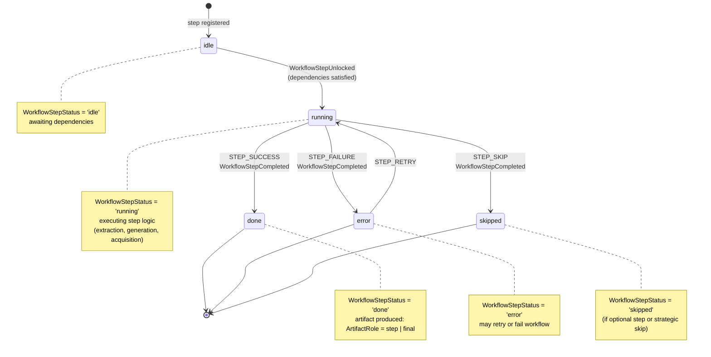
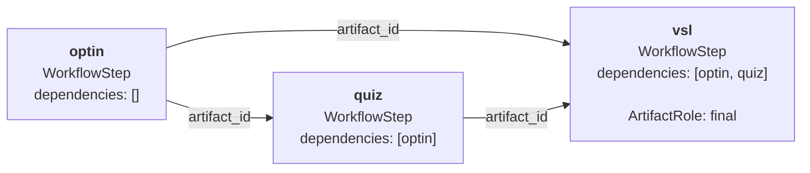
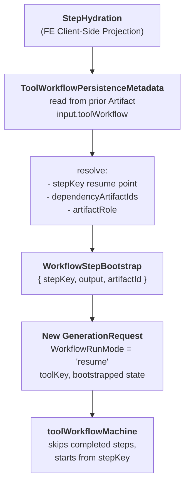
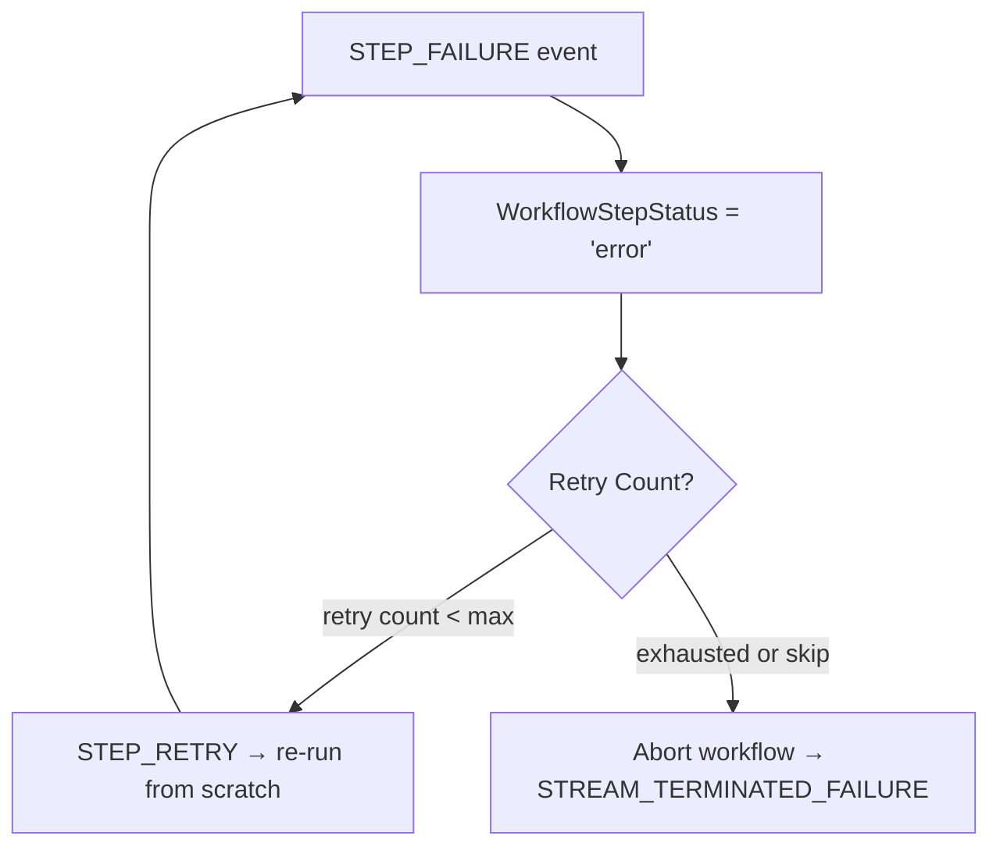

# Tool Generation Flow — Generation Context

## Overview

This diagram represents the canonical flow of a multi-step Tool execution in the **Generation** bounded context, grounded in the Ubiquitous Language (UL) defined in `domain-ubiquitous-language-glossary.md` and `domain-naming-decision-log.md`.

All domain terms are canonical as of 2026-05-24 (including DDD-086 through DDD-091 backend-first input-source decisions).

Session aggregation and route namespace separation are canonical as of DDD-051 and DDD-052.

> 📖 **Frontend UI Representation**: See [ToolGenerationFlow: Unified Flow Component](./tool-generation-flow.md) for the Frontend UI implementation of this flow. For detailed UX state routing and form behavior, see [Tool Generation Flow Source Of Truth (Frontend)](./specifications/tool-generation-flow-source-of-truth-spec.md).

---

## Tool Execution Flow (Complete Journey)

```mermaid
graph TB
    START([Start: GenerationRequest])
    REQUEST["<b>GenerationRequest</b><br/>ToolKey, ArtifactType,<br/>WorkflowRunMode, input"]
    
    ROUTING["<b>Route Resolution</b><br/>(RouteType = 'tool')"]
    PLAN["<b>ToolWorkflow Plan</b><br/>tool-workflow-registry:<br/>toolWorkflowStepOrder[toolKey]"]
    
    IDEMPOTENCY["<b>Idempotency Check</b><br/>IdempotencyCoordinator"]
    USAGE["<b>Quota Claim</b><br/>ClaimUsage"]
    
    BOOTSTRAP_CHECK{WorkflowRunMode?}
    
    BOOTSTRAP["<b>Resume: Inject Bootstrap</b><br/>WorkflowStepBootstrap<br/>{ stepKey, output, artifactId }"]
    
    MACHINE["<b>toolWorkflowMachine</b><br/>orchestrates WorkflowStep chain"]
    
    STEP_LOOP["FOR each WorkflowStep:"]
    
    DEPS["<b>WorkflowStepUnlocked</b><br/>(dependencies satisfied)"]
    EXEC["<b>Execute Step</b><br/>WorkflowStepType:<br/>- extraction<br/>- generation<br/>- acquisition"]
    
    ARTIFACT_OUT["<b>Step Output</b><br/>Artifact { id, type, role }"]
    
    ROLE_CHECK{ArtifactRole?}
    INTERMEDIATE["<b>Step Artifact</b><br/>artifactRole = 'step'<br/>feeds dependencies"]
    FINAL_ART["<b>Final Artifact</b><br/>artifactRole = 'final'<br/>complete Tool output"]
    
    COMPLETION["<b>WorkflowStepCompleted</b><br/>(unblock dependents)"]
    
    PERSIST_META["<b>Build Persistence Meta</b><br/>ToolWorkflowPersistenceMetadata<br/>{ toolKey, workflowType, runMode,<br/>artifactRole, stepKey,<br/>dependsOnSteps, dependencyArtifactIds }"]
    
    PERSIST["<b>Persist Artifact</b><br/>PersistenceBatch<br/>(DB + Redis idempotency cache)"]
    
    STREAM_EVENT["<b>BackendStreamEvent</b><br/>SSE wire → Frontend<br/>type: 'start' | 'chunk' | 'terminal'"]
    
    COMPLETE([Artifact Ready])
    
    START --> REQUEST
    REQUEST --> ROUTING
    ROUTING --> PLAN
    PLAN --> IDEMPOTENCY
    IDEMPOTENCY --> USAGE
    USAGE --> BOOTSTRAP_CHECK
    
    BOOTSTRAP_CHECK -->|resume/regenerate| BOOTSTRAP
    BOOTSTRAP_CHECK -->|new| MACHINE
    BOOTSTRAP --> MACHINE
    
    MACHINE --> STEP_LOOP
    STEP_LOOP --> DEPS
    DEPS --> EXEC
    EXEC --> ARTIFACT_OUT
    ARTIFACT_OUT --> ROLE_CHECK
    
    ROLE_CHECK -->|step| INTERMEDIATE
    ROLE_CHECK -->|final| FINAL_ART
    INTERMEDIATE --> COMPLETION
    FINAL_ART --> COMPLETION
    
    COMPLETION --> PERSIST_META
    PERSIST_META --> PERSIST
    PERSIST --> STREAM_EVENT
    STREAM_EVENT --> COMPLETE
```



---

## WorkflowStep State Machine



---

## Multi-Step Dependency Graph (Example: funnel-pages Tool)



**Tool**: funnel-pages

**Execution order**: optin → quiz → vsl (all subsequent steps depend on prior completion)

---

## Resume/Regenerate Flow



---

## Canonical Concepts (DDD Quick Reference)

| Term | Type | Role in Flow |
|---|---|---|
| **Tool** (DDD-026) | Concept | Organizing unit; encapsulates a multi-step generation capability |
| **ToolKey** (DDD-029) | Value Object | Cross-context identifier for a Tool; carries identity across FE/BE |
| **ToolWorkflow** (glossary) | Value Object | Generation-context routing path; determines artifact type and step chain |
| **GenerationRequest** (DDD-002) | Command | Input that triggers a generation; carries ToolKey, ArtifactType, user input |
| **WorkflowStep** (DDD-003) | Entity | A single step in a Tool's chain; abstract descriptor in BE |
| **WorkflowStepStatus** (glossary) | Value Object | Runtime state: idle, running, done, error, skipped |
| **WorkflowStepType** (DDD-027) | Value Object | Execution strategy: extraction, generation, acquisition (backend baseline implemented; progressive rollout by tool configuration) |
| **WorkflowRunMode** (glossary) | Value Object | Intent: new, resume, regenerate; normalized from requestInput.intent |
| **WorkflowStepUnlocked** (DDD-035) | Domain Event | Internal: dependencies satisfied, step ready to run |
| **WorkflowStepCompleted** (DDD-036) | Domain Event | Internal: step finished, artifact produced, dependents unblocked |
| **WorkflowStepBootstrap** (DDD-037) | Value Object | Resume point: { stepKey, output, artifactId } for resume/regenerate flows |
| **ArtifactRole** (DDD-033) | Value Object | Classification: 'step' (intermediate, feeds dependents) or 'final' (complete output) |
| **ToolWorkflowPersistenceMetadata** (DDD-034) | Value Object | Persistence contract: metadata embedded in artifact input.toolWorkflow for hydration |
| **Artifact** (DDD-001) | Entity | Persisted output of a generation; carries type, role, metrics, idempotency cache |
| **GenerationSession** (DDD-048) | Aggregate Root | Groups all artifacts produced in one multi-step tool execution |
| **SessionSummary** (DDD-051) | Value Object | Aggregate-list projection consumed by frontend for session archive and project contextual navigation |
| **SessionArtifactGroup** (DDD-049) | Value Object | Session detail projection for ordered step artifact display |
| **BackendStreamEvent** (DDD-009) | Domain Event | SSE wire event: start, chunk, terminal; crosses FE/BE boundary |

---

## BE/FE Integration Contract — API Fetch On XState Machines

Scope: DDD-086, DDD-087, DDD-089, DDD-091.

### Generation (BE) machine ownership

1. API-backed acquisition belongs to `WorkflowStepType = acquisition` execution inside Generation context orchestration (`toolWorkflowMachine` lifecycle).
2. External API fetch execution is backend-owned and resolved through `ApiServiceCatalog`; Frontend must not own direct external API runtime calls.
3. For `ApiServiceAccessMode = token`, credentials remain backend-boundary only.
4. Acquisition completion must preserve standard internal progression semantics: `WorkflowStepUnlocked` -> step run -> `WorkflowStepCompleted`.
5. Acquisition output is merged into the same context assembly path consumed by downstream steps and `GenerationRequest` processing; no parallel, tool-specific bypass pipeline is allowed.

Backend implementation evidence (2026-05-24):
1. Acquisition actor baseline: `apps/backend/src/lib/machines/generation/acquisition-chain.machine.ts`.
2. Acquisition-to-generation merge path: `apps/backend/src/lib/machines/generation/context-generation-assembly.ts` and `apps/backend/src/lib/machines/tool-workflow.machine.ts`.
3. ApiService persistence/catalog runtime: `packages/infra-db/migrations/20260524_000011_api_service_catalog.sql`, `apps/backend/src/lib/adapters/api-service.adapter.ts`, `apps/backend/src/lib/runtime/auth-http/admin-api-service-handlers.ts`, `apps/backend/src/lib/runtime/auth-http/tools-api-service-handlers.ts`.
4. Route capability declarations including ApiService surfaces: `apps/backend/src/lib/runtime/auth-http/route-table.ts`.
5. Verification suites: `apps/backend/src/lib/tests/runtime.acquisition-workflow.machine.test.ts`, `apps/backend/src/lib/tests/runtime.tools-orchestrate.test.ts`, `apps/backend/src/lib/tests/runtime.api-service-auth-http.test.ts`.

### Frontend (FE) integration boundary

1. FE keeps one pre-step trigger (`StartContextGenerationAction`, transitional copy `Avvia estrazione`) and does not add a second API-fetch CTA.
2. FE interacts only with backend tool APIs and receives progress through existing machine/view-model channels.
3. FE progress remains one umbrella `ContextGenerationPhase`; acquisition progress is surfaced as sub-status, not as a second top-level phase.
4. FE request assembly remains deterministic (`GenerationRequestAssembly`): direct input + file extraction + API acquisition data are composed into one payload boundary before step-1 generation dispatch.

### XState coherence rules (integration-level)

1. Keep actor-based execution boundaries explicit (acquisition as actor-driven step execution, consistent with existing extraction/generation strategy model).
2. Keep transition semantics deterministic: no hidden side paths that skip `toolWorkflowMachine` step status lifecycle.
3. Preserve existing FE/BE event contracts (`BackendStreamEvent`, machine completion/failure handling) to avoid divergent runtime channels for API fetch.

---

## Tool Execution Invariants

1. **Dependency Ordering**: No `WorkflowStep` executes until all its declared dependencies have reached `'done'` status.
2. **Artifact Role Consistency**: Intermediate steps produce `ArtifactRole = 'step'`; only the final step produces `'final'`.
3. **Resumable State**: `ToolWorkflowPersistenceMetadata` persists the exact state tree to allow deterministic resume from any completed step.
4. **Idempotency**: Each `GenerationRequest` maps to a unique `IdempotencyKey` scoped to `(userId, projectId, endpoint)`; duplicate requests return the cached artifact without re-running.
5. **Quota Enforcement**: `ClaimUsage` atomically decrements quota before `StreamTransport` begins; if quota is exhausted, the generation is rejected before any artifact is produced.
6. **No Cross-Tool Steps**: A `WorkflowStep` belongs to exactly one `Tool` and cannot be reused across different Tools in a single generation request (though step definitions may be shared in the registry).
7. **Namespace Separation**: aggregate session projections (`SessionSummary`, `SessionArtifactGroup`) map to `/api/tools/sessions*` and frontend `sessionsummary` routes, while non-aggregated artifact history/detail maps to `/api/artifacts*` and frontend `artifacts` routes.

---

## Frontend Projection Contract (SessionSummary / Artifacts / Projects)

Cross-context contract for FE navigation:

| UI concern | FE route namespace | Generation projection | Backend endpoint |
|---|---|---|---|
| Project contextual history | `/dashboard/projects/{projectId}` | `SessionSummary[]` filtered by project | `GET /api/tools/sessions?projectId={projectId}` |
| Session aggregate archive/detail | `/sessionsummary`, `/sessionsummary/{sessionId}` | `SessionSummary`, `SessionArtifactGroup` | `GET /api/tools/sessions`, `GET /api/tools/sessions/{sessionId}`, `GET /api/tools/sessions/{sessionId}/step/{stepKey}` (default slim projection; full content only when `includeContent=true`) |
| Artifact archive/detail | `/artifacts`, `/artifacts/{artifactId}` | `GenerationArtifact` | `GET /api/artifacts`, `GET /api/artifacts/{artifactId}` (default slim projection; full payload only when `includeInput=true` and/or `includeContent=true`) |

Implementation rollout note:
- Session detail endpoints are already exposed in backend runtime.
- Session list endpoint (`GET /api/tools/sessions`) remains the canonical target while transitional FE derivation from artifact listing is temporarily allowed.
- Runtime projection policy is explicit: read/list endpoints return minimal payload by default to reduce query and transport cost; FE callers that require full `GenerationRequest` input or full artifact content must request it with the include flags above.

---

## Error Handling & Rollback



---

## Persistence & Idempotency

When a generation completes, `PersistenceBatch` persists to both:

1. **PostgreSQL** (`artifacts` table):
   - `artifact_id`, `user_id`, `project_id`, `artifact_type`, `workflow_type`
   - `status` (completed | failed), `failure_reason`, `content`, `input_json`
   - `created_at`, `completed_at`, `llm_usage_metrics`

2. **Redis** (idempotency cache, TTL 24h):
   - Key: `idempotency:{userId}:{projectId}:{endpoint}:{idempotencyKey}`
   - Value: `{ artifactId, content, metadata }`
   - Used to replay the same generation on duplicate `GenerationRequest`

**Idempotency Determinism**: If the exact same `GenerationRequest` is received (same `idempotencyKey`), the cached artifact is returned **without re-running any steps**, preserving deterministic output and cost.

---

## Bounded Context Ownership

```
┌────────────────────────────────────────────────────────┐
│                 GENERATION CONTEXT                     │
│                  (Owner of Workflow)                   │
├────────────────────────────────────────────────────────┤
│ Responsible for:                                       │
│  ✓ ToolWorkflow routing                               │
│  ✓ GenerationRequest validation & idempotency        │
│  ✓ WorkflowStep orchestration & dependency graph     │
│  ✓ Artifact production & persistence                 │
│  ✓ BackendStreamEvent emission                        │
│  ✓ ToolWorkflowPersistenceMetadata construction      │
├────────────────────────────────────────────────────────┤
│ Consumed by:                                           │
│  • Frontend/UI (via BackendStreamEvent & hydration)   │
│  • Auth (input: AuthSessionPrincipal)                 │
│  • Usage/Quota (via ClaimUsage & audit history)       │
└────────────────────────────────────────────────────────┘
```

---

## Frontend-to-Generation Boundary Rule (DDD-081)

Tool input-file requiredness is enforced in Frontend Tool Workspace runtime before dispatch:

- Optional missing files do not block dispatch when required files are complete.
- Required missing files block dispatch and keep primary generation action disabled.

Scope note:

- This alignment is frontend-only for required/optional file readiness semantics.
- Backend generation contracts are unchanged at core route boundaries; API-backed acquisition integration is an additive extension under canonical `WorkflowStepType = acquisition` and `ApiService` governance.
