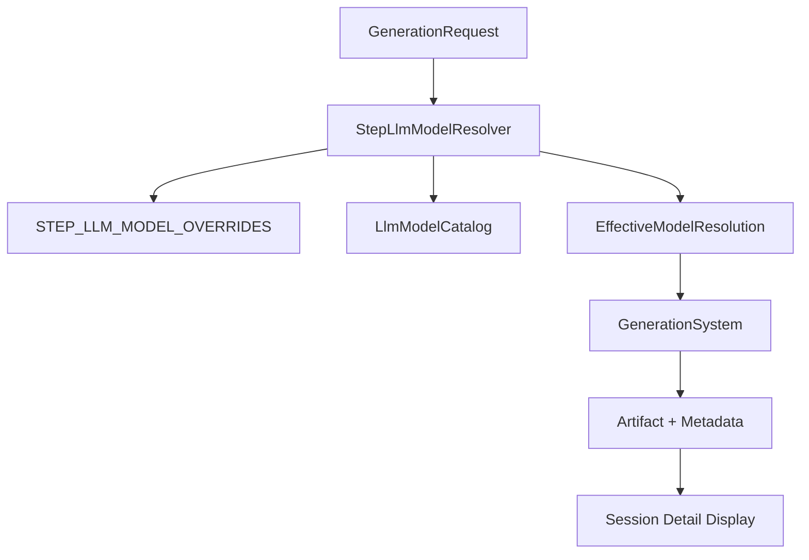

# LLM Model Step Override System - Implementation Plan


## Introduction

This plan implements the **LLM Model Step Override System** as approved in proposal `docs/02-design/llm-model-step-override-proposal.md`. The system enables per-step model configuration for future tools while maintaining backward compatibility for existing tools.

**Key Requirements:**
- Override system ready for future tools (existing tools unaffected)
- Override behavior invisible to users during generation
- Effective model tracked as artifact metadata
- Model information visible in session detail pages
- Static configuration governance through code review

## 1. Requirements & Constraints

### Core Requirements
- **REQ-001**: Implement static configuration system for step-specific model overrides
- **REQ-002**: Integrate model resolution into Generation System with metadata tracking
- **REQ-003**: Track effective model used in artifact metadata for audit/display
- **REQ-004**: Display model information in session detail pages (`sessionsummary/[id]`)
- **REQ-005**: Maintain 100% backward compatibility for existing tools
- **REQ-006**: Zero UI changes in tool workspace (overrides invisible to users)
- **REQ-007**: Configuration governance through standard code review process

### Technical Constraints  
- **CON-001**: No database schema changes - pure static configuration
- **CON-002**: Performance: model resolution < 10ms (in-memory lookup)
- **CON-003**: Existing tool behavior unchanged (always user selection)
- **CON-004**: Future tool override activation requires only config change

### DDD Compliance
- **DDD-150**: `StepLlmModelOverrideConfig` (Value Object, Generation context) ✅
- **DDD-151**: `StepLlmModelResolver` (Domain Service, Generation context) ✅
- **DDD-152**: `EffectiveModelResolution` (Value Object, Generation context) ✅

## 2. Architecture Overview

### System Components



### Resolution Precedence
1. **Static Override**: If configured for `(toolKey, stepKey)` and model enabled
2. **User Selection**: User-selected model if enabled in catalog  
3. **System Default**: `openrouter/auto` fallback (DDD-046)

### Metadata Flow
1. **Generation**: Effective model saved in artifact metadata
2. **Storage**: Metadata persisted with artifact  
3. **Display**: Session detail shows effective model + source info

## 3. Implementation Phases

### Phase 1: Backend Foundation (2-3 days)
**Priority**: High | **Risk**: Low

#### 1.1 Static Configuration System (1 day)

**Files to Create:**
```
apps/backend/src/lib/runtime/step-llm-model-overrides.config.ts
apps/backend/src/lib/types/step-llm-model-override.ts
```

**Configuration Structure:**
```typescript
export const STEP_LLM_MODEL_OVERRIDES = {
  // Ready for future tools - initially empty
  // Template for future use:
  // 'future-tool:extraction': {
  //   toolKey: 'future-tool',
  //   stepKey: 'extraction', 
  //   overrideModelId: 'openrouter/anthropic/claude-3.5-sonnet',
  //   reason: 'Optimized for structured data extraction'
  // }
} as const;

export type StepLlmModelOverrideConfig = {
  toolKey: ToolKey;
  stepKey: string;
  overrideModelId: LlmModelId;
  reason?: string;
};

export const createOverrideKey = (toolKey: ToolKey, stepKey: string): string =>
  `${toolKey}:${stepKey}`;
```

#### 1.2 Model Resolution Service (1.5 days)

**File to Create:**
```
apps/backend/src/lib/runtime/step-llm-model-resolver.ts
```

**Implementation:**
```typescript
export class StepLlmModelResolverImpl implements StepLlmModelResolver {
  constructor(private readonly llmModelCatalog: LlmModelCatalog) {}

  resolveEffectiveModel(
    toolKey: ToolKey,
    stepKey: string, 
    userSelectedModel: LlmModelId
  ): EffectiveModelResolution {
    // 1. Check static override
    const overrideKey = createOverrideKey(toolKey, stepKey);
    const override = STEP_LLM_MODEL_OVERRIDES[overrideKey];
    
    if (override) {
      const isEnabled = this.llmModelCatalog.isModelEnabled(override.overrideModelId);
      if (isEnabled) {
        return {
          effectiveModel: override.overrideModelId,
          source: 'step-override',
          overrideReason: override.reason,
          originalUserModel: userSelectedModel
        };
      }
    }
    
    // 2. Use user selection with validation
    const isUserModelEnabled = this.llmModelCatalog.isModelEnabled(userSelectedModel);
    return {
      effectiveModel: isUserModelEnabled ? userSelectedModel : 'openrouter/auto',
      source: 'user-selection'
    };
  }
}
```

#### 1.3 Startup Validation (0.5 days)

**File to Modify:**
```
apps/backend/src/server.ts
```

**Validation Logic:**
- Validate override config syntax
- Check all `toolKey` values exist in canonical registry
- Check all `overrideModelId` values exist in LlmModelCatalog
- Fail startup with clear error if invalid config

### Phase 2: Generation Integration (2-3 days)
**Priority**: High | **Risk**: Medium

#### 2.1 Artifact Metadata Enhancement (1.5 days)

**Files to Modify:**
```
apps/backend/src/lib/machines/generation-system.machine.ts
apps/backend/src/lib/types/xstate.ts
packages/infra-db/migrations/[new]_artifact_model_metadata.sql
```

**Metadata Structure:**
```typescript
interface ArtifactModelMetadata {
  effectiveModel: LlmModelId;
  modelSource: 'user-selection' | 'step-override';
  originalUserModel?: LlmModelId; // if overridden
  overrideReason?: string; // if overridden  
}

// Add to GenerationSystemContext
interface GenerationSystemContext {
  // ... existing fields
  effectiveModelResolution?: EffectiveModelResolution;
}
```

#### 2.2 Generation Request Processing (1 day)

**Files to Modify:**
```
apps/backend/src/lib/runtime/generation-request-node.ts
apps/backend/src/lib/machines/generation-system.definition.ts
```

**Integration Points:**
```typescript
// In generation-request-node.ts
const effectiveModelResolution = stepLlmModelResolver.resolveEffectiveModel(
  extractToolKey(payload),
  extractStepKey(payload),
  requireStringField(payload, 'model') as LlmModelId
);

// Use effectiveModelResolution.effectiveModel for generation
// Store full resolution in context for metadata
```

#### 2.3 Step Key Extraction (0.5 days)

**File to Create:**
```
apps/backend/src/lib/runtime/step-key-extractor.ts  
```

**Utility Function:**
```typescript
export const extractStepKeyFromRequest = (
  requestInput: GenerationRequestInput
): string | null => {
  // Extract step key from tool workflow metadata
  // Return null for non-step requests (extraction, etc.)
};
```

### Phase 3: Frontend Integration (1-2 days)
**Priority**: Medium | **Risk**: Low

#### 3.1 Contracts Extension (0.5 days)

**Files to Create/Modify:**
```
packages/contracts/src/step-llm-model-override.ts
packages/contracts/src/index.ts
```

**Contract Types:**
```typescript
export type SessionArtifactModelInfo = {
  effectiveModel: string; // LlmModelId
  modelSource: 'user-selection' | 'step-override';
  overrideReason?: string;
  originalUserModel?: string; // if overridden
};
```

#### 3.2 Session Detail Enhancement (1 day)

**Files to Modify:**
```
apps/frontend/src/features/sessionsummary/pages/SessionSummaryDetailPage.tsx
apps/backend/src/lib/runtime/auth-http/tools-session-handlers.ts
```

**Display Logic:**
```tsx
const ModelInfoDisplay: React.FC<{
  artifact: SessionArtifactDetail;
}> = ({ artifact }) => (
  <Box sx={{ mt: 1 }}>
    <Typography variant="caption" color="textSecondary">
      Modello: {artifact.modelInfo.effectiveModel}
      {artifact.modelInfo.modelSource === 'step-override' && (
        <Chip 
          size="small" 
          label="Override" 
          color="info"
          sx={{ ml: 1, height: 16 }}
        />
      )}
    </Typography>
    {artifact.modelInfo.overrideReason && (
      <Typography variant="caption" display="block" color="textSecondary">
        Motivo: {artifact.modelInfo.overrideReason}
      </Typography>
    )}
  </Box>
);
```

#### 3.3 Backend API Extension (0.5 days)

**Files to Modify:**
```
apps/backend/src/lib/runtime/auth-http/tools-session-handlers.ts
```

**API Enhancement:**
- Include model metadata in session detail response
- Ensure backward compatibility for existing sessions
- Handle legacy artifacts without model metadata

### Phase 4: Testing & Documentation (1-2 days) 
**Priority**: High | **Risk**: Low

#### 4.1 Test Coverage (1 day)

**Test Files to Create:**
```
apps/backend/src/lib/tests/step-llm-model-resolver.test.ts
apps/backend/src/lib/tests/generation-system-model-override.test.ts
apps/frontend/src/features/sessionsummary/pages/SessionSummaryDetailPage.test.tsx
```

**Test Scenarios:**
- Model resolution precedence logic
- Fallback when override model disabled  
- Metadata persistence and retrieval
- Session detail display with/without override
- Backward compatibility for existing tools
- Configuration validation at startup

#### 4.2 Documentation (0.5 days)

**Documentation to Create:**
```
docs/development/llm-model-override-configuration-guide.md
```

**Content:**
- How to configure overrides for new tools
- Configuration format and validation rules
- Testing checklist for new overrides
- Troubleshooting common issues

#### 4.3 Future Tool Template (0.5 days)

**Template Setup:**
- Complete example of override configuration
- Step-by-step activation checklist
- Integration testing template

## 4. Testing Strategy

### Test Categories

#### Unit Tests
- `StepLlmModelResolver` resolution logic
- Configuration validation functions
- Metadata persistence/retrieval
- Frontend display components

#### Integration Tests  
- End-to-end generation with override
- Session detail model display
- Fallback scenarios (disabled models)
- Backward compatibility verification

#### Manual Testing
- Override configuration workflow
- Session detail UI verification
- Performance testing (< 10ms resolution)
- Cross-browser compatibility

## 5. Deployment Strategy

### Rollout Phases
1. **Deploy Backend**: Model resolution + metadata tracking
2. **Deploy Frontend**: Session detail enhancements
3. **Configuration**: Ready for future tool override activation
4. **Monitoring**: Track performance and error rates

### Rollback Plan
- Configuration rollback: Revert config file changes
- Code rollback: Standard deployment rollback procedures
- Data integrity: Metadata is additive (no breaking changes)

### Success Metrics
- Zero impact on existing tool performance
- Model resolution < 10ms p95
- Session detail displays model info correctly
- Configuration validation catches errors at startup

## 6. Risk Assessment

### High Priority Risks

#### Risk: Performance Impact
- **Impact**: High
- **Probability**: Low  
- **Mitigation**: In-memory static config, benchmark verification

#### Risk: Metadata Schema Changes
- **Impact**: Medium
- **Probability**: Low
- **Mitigation**: Additive changes only, backward compatibility

#### Risk: Configuration Errors
- **Impact**: Medium  
- **Probability**: Medium
- **Mitigation**: Startup validation, clear error messages

### Medium Priority Risks

#### Risk: Frontend Display Issues
- **Impact**: Low
- **Probability**: Low
- **Mitigation**: Comprehensive test coverage

#### Risk: Model Availability Changes
- **Impact**: Low
- **Probability**: Medium
- **Mitigation**: Automatic fallback logic

## 7. Future Enhancements

### Phase 2 Capabilities (Future)
- Dynamic override configuration (if needed)
- Override analytics and usage tracking
- A/B testing framework for model selection
- Performance optimization based on usage patterns

### Tool Integration Template
- Standardized process for adding overrides to new tools
- Automated testing for override configurations
- Configuration documentation generation

## 8. Acceptance Criteria

### Functional Requirements
- [ ] Model resolution works correctly (override → user → default)
- [ ] Artifact metadata includes effective model information
- [ ] Session detail displays model information clearly
- [ ] Existing tools unaffected by implementation
- [ ] Configuration validation prevents invalid overrides
- [ ] Zero user-visible changes during generation

### Non-Functional Requirements  
- [ ] Model resolution performance < 10ms p95
- [ ] 100% backward compatibility maintained
- [ ] Configuration changes require code review approval
- [ ] System handles model availability changes gracefully
- [ ] Memory usage impact < 1MB for configuration

### Quality Gates
- [ ] All tests passing (unit + integration + manual)
- [ ] TypeScript compilation clean
- [ ] No performance regression in existing flows
- [ ] Security review passed (no new attack vectors)
- [ ] Documentation complete and reviewed

## 9. Implementation Checklist

### Pre-Implementation
- [ ] Verify DDD decisions in glossary (DDD-150, DDD-151, DDD-152)
- [ ] Confirm LlmModelCatalog.isModelEnabled() availability  
- [ ] Setup development environment for testing
- [ ] Coordinate with team on code review assignments

### Phase 1 Completion
- [ ] Static configuration system implemented
- [ ] Model resolution service working
- [ ] Startup validation active
- [ ] Unit tests passing

### Phase 2 Completion  
- [ ] Artifact metadata enhancement complete
- [ ] Generation integration working
- [ ] Step key extraction implemented
- [ ] Integration tests passing

### Phase 3 Completion
- [ ] Frontend session detail enhanced
- [ ] Backend API extended  
- [ ] Contracts updated
- [ ] UI tests passing

### Phase 4 Completion
- [ ] Full test coverage implemented
- [ ] Documentation complete
- [ ] Future tool template ready
- [ ] Performance benchmarks met

### Production Readiness
- [ ] All acceptance criteria met
- [ ] Security review complete
- [ ] Performance validation passed
- [ ] Rollback plan tested
- [ ] Monitoring setup complete

## 10. Configuration Examples

### Future Tool Override Example
```typescript
// When adding override for new tool 'advanced-seo':
export const STEP_LLM_MODEL_OVERRIDES = {
  'advanced-seo:extraction': {
    toolKey: 'advanced-seo',
    stepKey: 'extraction',
    overrideModelId: 'openrouter/anthropic/claude-3.5-sonnet',
    reason: 'Superior accuracy for structured data extraction from complex sources'
  },
  'advanced-seo:analysis': {
    toolKey: 'advanced-seo', 
    stepKey: 'analysis',
    overrideModelId: 'openrouter/openai/gpt-4-turbo',
    reason: 'Advanced reasoning capabilities for competitive analysis'
  },
  'advanced-seo:reporting': {
    toolKey: 'advanced-seo',
    stepKey: 'reporting', 
    overrideModelId: 'openrouter/meta-llama/llama-3.1-70b-instruct',
    reason: 'Cost-effective model for report generation with good Italian support'
  }
} as const;
```

### Session Detail Display Example
```
[Session Detail Page]

Step 1: Estrazione Dati
├─ Status: Completato
├─ Modello: openrouter/anthropic/claude-3.5-sonnet [Override]
├─ Motivo: Superior accuracy for structured data extraction
└─ Durata: 2.3s

Step 2: Analisi Competitiva  
├─ Status: Completato
├─ Modello: openrouter/openai/gpt-4-turbo [Override]
├─ Motivo: Advanced reasoning capabilities for competitive analysis
└─ Durata: 4.1s

Step 3: Generazione Report
├─ Status: Completato  
├─ Modello: openrouter/auto [Selezione Utente]
└─ Durata: 3.7s
```

This implementation plan provides a complete, DDD-compliant solution for per-step model override configuration while maintaining backward compatibility and preparing for future tool enhancement capabilities.